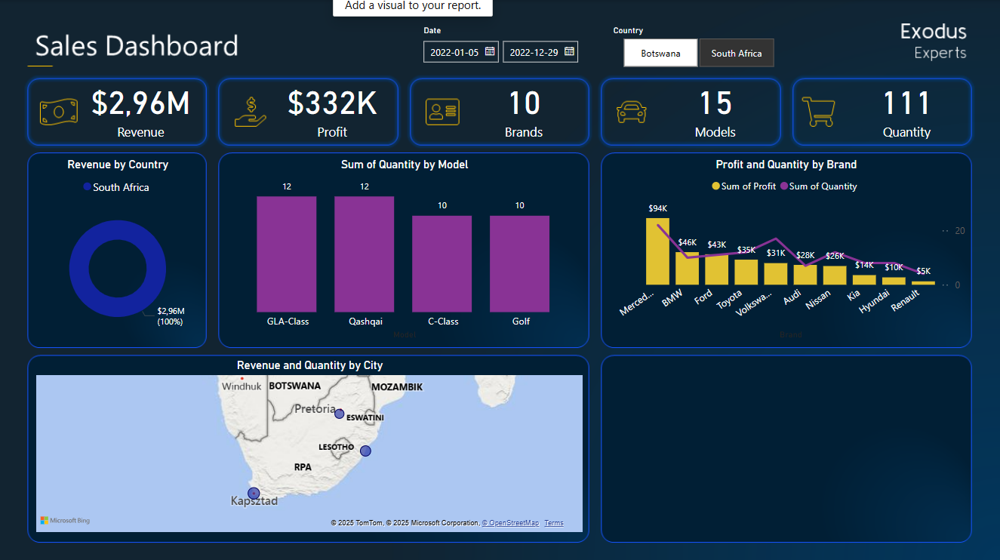

# sales_powerbi_dashboard
# 📊 Sales Dashboard – Power BI

Ten projekt przedstawia interaktywny **dashboard sprzedażowy** wykonany w Power BI. Powstał w ramach ćwiczenia z kursu  'Career Boost with Power BI', na podstawie prostych danych sprzedażowych zapisanych w pliku Excel. Celem było zaprezentowanie umiejętności tworzenia czytelnych i atrakcyjnych wizualizacji.

## 🧾 Dane

- Dane źródłowe: plik Excel z informacjami o sprzedaży (kraje, miasta, marki, modele, ilość, przychód, zysk)
- Zakres dat: 2022-01-05 do 2022-12-29
- Kraje: Botswana, South Africa

## 📈 Zawartość dashboardu

Dashboard zawiera:
- 📌 **KPI**: łączny przychód, zysk, liczba marek, modeli i sprzedanych produktów
- 📍 **Revenue by Country** – udział krajów w przychodach
- 📊 **Sum of Quantity by Model** – najpopularniejsze modele aut
- 💰 **Profit and Quantity by Brand** – porównanie zysku i ilości według marki
- 🗺️ **Revenue and Quantity by City** – mapa z podziałem na miasta (mapa Bing)

Dashboard zawiera również **filtry**:
- Zakres dat
- Wybór kraju (przycisk wielokrotnego wyboru)

## 🖼️ Podgląd

## 🛠️ Narzędzia użyte w projekcie

- [Power BI Desktop](https://powerbi.microsoft.com)
- Microsoft Excel (jako źródło danych)
- Podstawowa obróbka danych w Power Query

## 📂 Struktura repozytorium
├── sales_dashboard.pbix # Plik Power BI
├── data/
│ └── sales_data.xlsx # Dane źródłowe (Excel)
├── img/
│ └── sales_dashboard.png # Zrzut ekranu dashboardu
└── README.md

## ✨ Autor

Projekt wykonany w ramach kursu Power BI. Repozytorium opublikowane w celach edukacyjnych i jako część portfolio.

